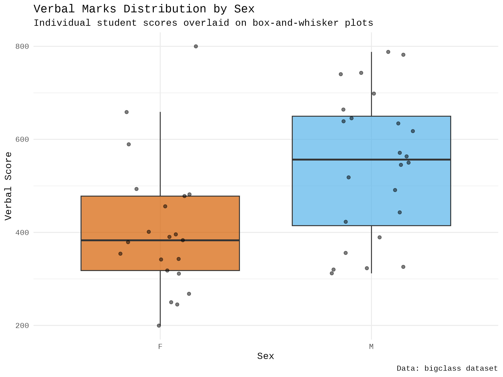

:::: {.columns}
::: {.column width="50%"}

## Sample slides
#### PlaceHolderName
#### Universiti Malaysia Perlis
#### [placeholder@email.com](mailto:placeholder@email.com)

<!-- __AUDIO_INTRO_DO_NOT_TOUCH__ -->

:::

::: {.column width="50%"}

:::

::::

---

:::: {.columns}
::: {.column width="50%"}
### Slide one
**Key Concepts:**
- Energy conservation per @carnot1824.
- $\Delta U = Q - W$
:::

::: {.column width="50%"}

:::
::::

---

---

:::: {.columns}
::: {.column width="50%"}
### The Master Equation
The fundamental relation of thermodynamics:

$$\Delta U = Q - W$$

The work done $W$ is positive when the system expands against an external pressure.
:::

::: {.column width="50%"}
<video data-src="media/videos/sample.mp4" data-autoplay loop muted width="100%"></video>
:::

::::

---

:::: {.columns}
::: {.column width="50%"}
### Visualizing the Gas Law
**Interactive Model:**

- P, V, and T relationships.
- Use the slider to adjust pressure.
- Observe the phase boundary.
:::

::: {.column width="50%"}
<iframe 
  data-src="media/plots/sample.html" 
  width="100%" 
  height="500px" 
  style="border:none;" 
  scrolling="no">
</iframe>
:::
::::

---

:::: {.columns}
::: {.column width="50%"}
### Statistical Process Control: X-bar.one Chart
**Details:**
- **Machine:** 1
- **Temperature:** 338K
- **Pressure:** 200kPa
- Monitoring `PartLength` stability using an X-bar.one chart.
- Control limits calculated based on the data for this specific condition.
:::

::: {.column width="50%"}
<iframe data-src='media/plots/control_chart_machine_1_temp_338_pressure_200.html' width='100%' height='500px' style='border:none;'></iframe>
:::
::::

---

:::: {.columns}
::: {.column width="50%"}
### Statistical Process Control: X-bar.one Chart
**Details:**
- **Machine:** 1
- **Temperature:** 338K
- **Pressure:** 200kPa
- Monitoring `PartLength` stability using an X-bar.one chart.
- Control limits calculated based on the data for this specific condition.
:::

::: {.column width="50%"}
<iframe data-src='media/plots/control_chart_machine_1_temp_338_pressure_200.html' width='100%' height='500px' style='border:none;'></iframe>
:::
::::

---

:::: {.columns}
::: {.column width="50%"}
### Statistical Process Control: X-bar.one Chart
**Details:**
- **Machine:** 1
- **Temperature:** 338K
- **Pressure:** 200kPa
- Monitoring `PartResistance` stability using an X-bar.one chart.
- Control limits calculated based on the data for this specific condition.
:::

::: {.column width="50%"}
<iframe data-src='media/plots/control_chart_machine_1_temp_338_pressure_200_partresistance.html' width='100%' height='500px' style='border:none;'></iframe>
:::
::::

---

:::: {.columns}
::: {.column width="50%"}
### Process Capability Analysis: PartLength Distribution
**Details:**
- **Machine:** 1
- **Temperature:** 338K
- **Pressure:** 200kPa
- This chart shows the distribution of `PartLength` under the specified conditions.
- To perform a complete process capability analysis (e.g., Cp, Cpk), please provide the Lower Specification Limit (LSL) and Upper Specification Limit (USL) for `PartLength`.
:::

::: {.column width="50%"}
<iframe data-src='media/plots/distribution_partlength_machine_1_temp_338_pressure_200.html' width='100%' height='500px' style='border:none;'></iframe>
:::
::::

---

:::: {.columns}
::: {.column width="50%"}
### Process Capability Analysis: PartResistance Distribution
**Details:**
- **Machine:** 1
- **Temperature:** 338K
- **Pressure:** 200kPa
- This chart shows the distribution of `PartResistance` under the specified conditions.
- To perform a complete process capability analysis (e.g., Cp, Cpk), please provide the Lower Specification Limit (LSL) and Upper Specification Limit (USL) for `PartResistance`.
:::

::: {.column width="50%"}
<iframe data-src='media/plots/distribution_partresistance_machine_1_temp_338_pressure_200.html' width='100%' height='500px' style='border:none;'></iframe>
:::
::::

---

:::: {.columns}
::: {.column width="50%"}
### Statistical Process Control: X-bar.one Chart
**Details:**
- **Machine:** 2
- **Temperature:** 338K
- **Pressure:** 200kPa
- Monitoring `PartLength` stability using an X-bar.one chart.
- Control limits calculated based on the data for this specific condition.
:::

::: {.column width="50%"}
<iframe data-src='media/plots/control_chart_machine_2_temp_338_pressure_200_partlength.html' width='100%' height='500px' style='border:none;'></iframe>
:::
::::

---

:::: {.columns}
::: {.column width="50%"}
### Statistical Process Control: X-bar.one Chart
**Details:**
- **Machine:** 2
- **Temperature:** 338K
- **Pressure:** 200kPa
- Monitoring `PartResistance` stability using an X-bar.one chart.
- Control limits calculated based on the data for this specific condition.
:::

::: {.column width="50%"}
<iframe data-src='media/plots/control_chart_machine_2_temp_338_pressure_200_partresistance.html' width='100%' height='500px' style='border:none;'></iframe>
:::
::::

---

:::: {.columns}
::: {.column width="50%"}
### Process Capability Analysis: PartLength Distribution
**Details:**
- **Machine:** 2
- **Temperature:** 338K
- **Pressure:** 200kPa
- This chart shows the distribution of `PartLength` under the specified conditions.
- To perform a complete process capability analysis (e.g., Cp, Cpk), please provide the Lower Specification Limit (LSL) and Upper Specification Limit (USL) for `PartLength`.
:::

::: {.column width="50%"}
<iframe data-src='media/plots/distribution_partlength_machine_2_temp_338_pressure_200.html' width='100%' height='500px' style='border:none;'></iframe>
:::
::::

---

:::: {.columns}
::: {.column width="50%"}
### Process Capability Analysis: PartResistance Distribution
**Details:**
- **Machine:** 2
- **Temperature:** 338K
- **Pressure:** 200kPa
- This chart shows the distribution of `PartResistance` under the specified conditions.
- To perform a complete process capability analysis (e.g., Cp, Cpk), please provide the Lower Specification Limit (LSL) and Upper Specification Limit (USL) for `PartResistance`.
:::

::: {.column width="50%"}
<iframe data-src='media/plots/distribution_partresistance_machine_2_temp_338_pressure_200.html' width='100%' height='500px' style='border:none;'></iframe>
:::
::::

---

:::: {.columns}
::: {.column width="50%"}
### Statistical Process Control: X-bar.one Chart
**Details:**
- **Machine:** 3
- **Temperature:** 338K
- **Pressure:** 200kPa
- Monitoring `PartLength` stability using an X-bar.one chart.
- Control limits calculated based on the data for this specific condition.
:::

::: {.column width="50%"}
<iframe data-src='media/plots/control_chart_machine_3_temp_338_pressure_200_partlength.html' width='100%' height='500px' style='border:none;'></iframe>
:::
::::

---

:::: {.columns}
::: {.column width="50%"}
### Statistical Process Control: X-bar.one Chart
**Details:**
- **Machine:** 3
- **Temperature:** 338K
- **Pressure:** 200kPa
- Monitoring `PartResistance` stability using an X-bar.one chart.
- Control limits calculated based on the data for this specific condition.
:::

::: {.column width="50%"}
<iframe data-src='media/plots/control_chart_machine_3_temp_338_pressure_200_partresistance.html' width='100%' height='500px' style='border:none;'></iframe>
:::
::::

---

:::: {.columns}
::: {.column width="50%"}
### Process Capability Analysis: PartLength Distribution
**Details:**
- **Machine:** 3
- **Temperature:** 338K
- **Pressure:** 200kPa
- This chart shows the distribution of `PartLength` under the specified conditions.
- To perform a complete process capability analysis (e.g., Cp, Cpk), please provide the Lower Specification Limit (LSL) and Upper Specification Limit (USL) for `PartLength`.
:::

::: {.column width="50%"}
<iframe data-src='media/plots/distribution_partlength_machine_3_temp_338_pressure_200.html' width='100%' height='500px' style='border:none;'></iframe>
:::
::::

---

:::: {.columns}
::: {.column width="50%"}
### Process Capability Analysis: PartResistance Distribution
**Details:**
- **Machine:** 3
- **Temperature:** 338K
- **Pressure:** 200kPa
- This chart shows the distribution of `PartResistance` under the specified conditions.
- To perform a complete process capability analysis (e.g., Cp, Cpk), please provide the Lower Specification Limit (LSL) and Upper Specification Limit (USL) for `PartResistance`.
:::

::: {.column width="50%"}
<iframe data-src='media/plots/distribution_partresistance_machine_3_temp_338_pressure_200.html' width='100%' height='500px' style='border:none;'></iframe>
:::
::::

---

:::: {.columns}
::: {.column width="50%"}
### Part Resistance for Machine 1 by Pressure
**Details:**
- This boxplot visualizes the distribution of `PartResistance` for `Machine` 1 across different `Pressure` settings.
- It helps to observe the central tendency, spread, and potential outliers of `PartResistance` at each pressure level.
:::

::: {.column width="50%"}
<iframe data-src='media/plots/boxplot_machine_1_partresistance_by_pressure.html' width='100%' height='500px' style='border:none;'></iframe>
:::
::::

---

:::: {.columns}
::: {.column width="50%"}
### Part Resistance for Machine 1 by Pressure
**Details:**
- **Machine:** 1
- **Upper Specification Limit (USL):** 10 (Lower is better, no LSL)
- **ANOVA Result (Pr(>F) for Pressure):** $['0.0398']$
- This boxplot visualizes the distribution of `PartResistance` for `Machine` 1 across different `Pressure` settings, with the USL indicated by a dashed red line.
- The ANOVA result indicates the statistical significance of `Pressure` on `PartResistance`.
:::

::: {.column width="50%"}
<iframe data-src='media/plots/boxplot_machine_1_partresistance_by_pressure_usl.html' width='100%' height='500px' style='border:none;'></iframe>
:::
::::

---

:::: {.columns}
::: {.column width="50%"}
### Part Resistance for Machine 1 by Temperature
**Details:**
- **Machine:** 1
- **Upper Specification Limit (USL):** 10 (Lower is better, no LSL)
- **ANOVA Result (Pr(>F) for Temperature):** 0.2747
- This boxplot visualizes the distribution of `PartResistance` for `Machine` 1 across different `Temperature` settings, with the USL indicated by a dashed red line.
- The ANOVA result indicates the statistical significance of `Temperature` on `PartResistance`.
:::

::: {.column width="50%"}
<iframe data-src='media/plots/boxplot_machine_1_partresistance_by_temperature_usl.html' width='100%' height='500px' style='border:none;'></iframe>
:::
::::

---

:::: {.columns}
::: {.column width="50%"}
### Part Resistance for Machine 1 by Temperature
**Details:**
- **Machine:** 1
- **Upper Specification Limit (USL):** 10 (Lower is better, no LSL)
- **ANOVA Result (Pr(>F) for Temperature):** $0.2747$
- This boxplot visualizes the distribution of `PartResistance` for `Machine` 1 across different `Temperature` settings, with the USL indicated by a dashed red line.
- The ANOVA result indicates the statistical significance of `Temperature` on `PartResistance`.
:::

::: {.column width="50%"}
<iframe data-src='media/plots/boxplot_machine_1_partresistance_by_temperature_usl_new.html' width='100%' height='500px' style='border:none;'></iframe>
:::
::::
